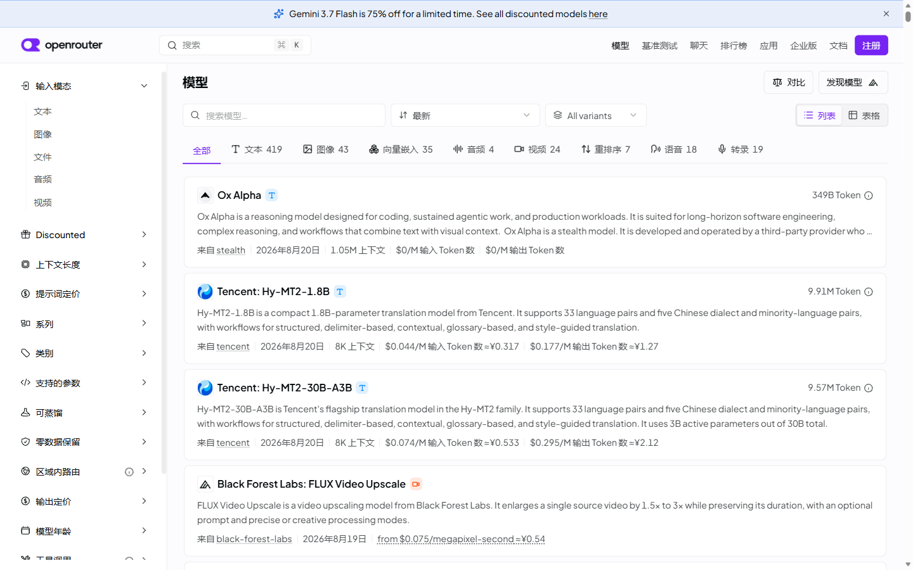

# OpenRouter 中文化增强版 💱

<p align="center">
  <strong>现代化 OpenRouter 全站中文化油猴脚本：20+ 页面全覆盖 + 实时人民币参考价 + 词库单文件内联 + 上游自动同步与镜像容灾</strong>
</p>

<p align="center">
  <a href="https://raw.githubusercontent.com/3304711297/openrouter-chinese-plus/main/openrouter-chinese-plus.user.js"></a>
  <a href="https://github.com/3304711297/openrouter-chinese-plus/actions/workflows/ci.yml"></a>
  <a href="https://github.com/3304711297/openrouter-chinese-plus/actions/workflows/upstream-sync.yml"></a>
  
  <a href="./LICENSE"></a>
</p>

---

## 📸 实机效果展示

<p align="center">
  
</p>

> 真实环境实测：[openrouter.ai/models](https://openrouter.ai/models) 模型列表、筛选器、侧边栏全量中文化；保留官方美元原价的同时，在每百万 Token 价格后自动追加高精度 **`≈¥xx.xx` 人民币参考价**。

---

## 🚀 一键安装

在已安装 [ScriptCat 脚本猫](https://scriptcat.org/) 或 [Tampermonkey](https://www.tampermonkey.net/) 的浏览器中点击安装：

| 安装通道 | 链接 | 说明 |
| :--- | :--- | :--- |
| ⚡ **GitHub 直连通道** | [一键安装 openrouter-chinese-plus.user.js](https://raw.githubusercontent.com/3304711297/openrouter-chinese-plus/main/openrouter-chinese-plus.user.js) | **推荐**。版本更新秒级生效 |
| 🌐 **jsDelivr 镜像通道** | [一键安装 (jsDelivr CDN 镜像)](https://cdn.jsdelivr.net/gh/3304711297/openrouter-chinese-plus@main/openrouter-chinese-plus.user.js) | 国内无需代理（约有 12 小时 CDN 缓存） |

---

## ❓ 常见安装问题速查 (FAQ)

<details>
<summary><strong>👉 Edge + ScriptCat 提示 <code>ERR_BLOCKED_BY_CLIENT</code> 怎么办？</strong></summary>

这是 Edge 浏览器的安全权限机制导致的：
1. 在 Edge 地址栏打开 `edge://extensions`；
2. 找到 **ScriptCat（脚本猫）**，点击 **「详细信息」**；
3. 勾选打开 **「允许访问文件 URL」** 开关后，重新刷新安装链接即可顺利弹出安装面板。
</details>

<details>
<summary><strong>👉 脚本猫首次提示跨域汇率请求授权？</strong></summary>

首次运行时，脚本会通过 Yahoo Finance / Frankfurter 获取最新美元兑人民币汇率。点击 **「总是允许」** 即可。若拒绝，脚本会自动回退到默认汇率 7.2 或使用你在菜单中手动填写的汇率。
</details>

---

## ⚡ 核心功能与架构优势

### 1. 🌐 全站深度中文化 (20+ 页面类型)
- **覆盖全站核心场景**：模型库 (`/models`)、排行榜 (`/rankings`)、活动日历、账单设置、Playground 与开发文档。
- **React 组件友好**：基于 `MutationObserver` 与 `TreeWalker` 精准操作文本叶子节点，支持 React 拆分文本节点拼接（如 `90` + `% off`），绝不破坏前端组件状态与事件监听。
- **代码与 Key 安全区**：API Key 输入框、代码高亮块、聊天上下文输入区域受到严格保护，绝不产生误翻译。

### 2. 💱 独创人民币参考价模块 (4 级容灾链路)
- **无感注入**：保留官方美元原价（`$0.15/M`），并在其后智能追加 `≈¥1.08/M` 实时参考价（免费模型 `$0` 智能免标注）。
- **四级汇率容灾架构**：
  ```text
  Yahoo Finance API (实时高精度)
       │ (失败)
       ▼
  Frankfurter API (官方备用)
       │ (失败)
       ▼
  本地 30 分钟缓存 / 72 小时历史兜底
       │ (离线)
       ▼
  静态保底基准值 (7.2)
  ```
- **纯本地安全计算**：汇率计算全部在本地浏览器沙箱完成，不向任何第三方上报页面数据。

### 3. 📦 词库单文件内联与 6 小时自动同步
- **解决缓存死锁**：放弃原版的 `@require` 外部词库外链形式，将词库直接内联打包为单文件，彻底杜绝“脚本更新但外部词库被浏览器永久缓存”的常见痛点。
- **自动化追踪**：GitHub Actions 每 6 小时自动检查上游词库，有更新自动触发构建与发版。

---

## 🔄 上游项目对比与取舍

| 上游项目 | 取舍决策 | 理由与规范 |
| :--- | :--- | :--- |
| [datou1996/openrouter-chinese](https://github.com/datou1996/openrouter-chinese) | ✅ **整体采用** (MIT) | 覆盖 20+ 页面，翻译质量最完善，排障机制成熟 |
| [LynnGuo666/OpenRouter_Chinese](https://github.com/LynnGuo666/OpenRouter_Chinese) | 💡 **借鉴思路，代码 100% 原创重写** | 原作者代码采用非商业许可；本项目纯原创实现，全库保持 MIT 纯正开源 |
| [isdoge/openrouter-chinese](https://github.com/isdoge/openrouter-chinese) | ❌ **未并入** | 词库为 datou 版子集，无独有功能 |

---

## 🛠️ 本地开发与测试

```bash
# 1. 运行人民币模块单元测试 (node:test 零外部依赖)
node --test tests/cny-price.test.cjs

# 2. 检查上游词库更新
node scripts/check-upstream.mjs

# 3. 编译并输出单文件产物
node build.mjs
node --check openrouter-chinese-plus.user.js
```

---

## 📄 免责声明与开源协议

本项目依据 **MIT 许可证** 开源。

*本脚本为第三方开源作品，与 OpenRouter 官方无关。人民币价格仅按市场公开汇率提供本地计算参考，不代表 OpenRouter 官方结算币种，亦不包含银行换汇手续费与跨境税费。*
